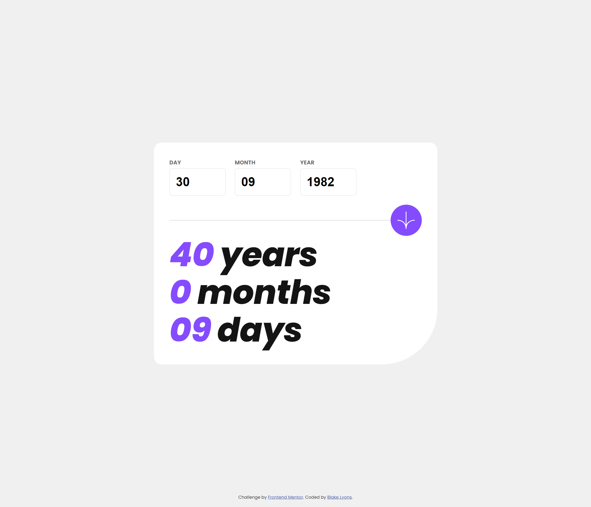

# Frontend Mentor - Age Calculator App Solution

This is a solution to the [Age calculator app challenge on Frontend Mentor](https://www.frontendmentor.io/challenges/age-calculator-app-dF9DFFpj-Q). Frontend Mentor challenges help you improve your coding skills by building realistic projects.

## Table of contents

-   [Overview](#overview)
    -   [The challenge](#the-challenge)
    -   [Screenshot](#screenshot)
    -   [Links](#links)
-   [My process](#my-process)
    -   [Built with](#built-with)
    -   [What I learned](#what-i-learned)
    -   [Continued development](#continued-development)
-   [Author](#author)

**Note: Delete this note and update the table of contents based on what sections you keep.**

## Overview

### The challenge

Users should be able to:

-   View an age in years, months, and days after submitting a valid date through the form
-   Receive validation errors if:
    -   Any field is empty when the form is submitted
    -   The day number is not between 1-31
    -   The month number is not between 1-12
    -   The year is in the future
    -   The date is invalid e.g. 31/04/1991 (there are 30 days in April)
-   View the optimal layout for the interface depending on their device's screen size
-   See hover and focus states for all interactive elements on the page
-   **Bonus**: See the age numbers animate to their final number when the form is submitted

### Screenshot



### Links

-   Solution URL: [Add solution URL here](https://github.com/blakelyons/frontend-mentor-age-calculator)
-   Live Site URL: [Add live site URL here](https://frontend-mentor-age-calculator.pages.dev/)

## My process

### Built with

-   Semantic HTML5 markup
-   CSS custom properties
-   Flexbox
-   CSS Grid
-   Mobile-first workflow
-   [Vue](https://vuejs.org/guide/introduction.html) - JS library
-   [Sass](https://sass-lang.com/) - For CSS

### What I learned

Brushing off some rust on JavaScript Dates and continuing to use Vue 3 Composition API from start to the build.

Bonus completed!

```js
const countUp = (targetValue, property) => {
    const startValue = 0;
    const steps = 60;
    const stepValue = (targetValue - startValue) / steps;
    let currentValue = startValue;

    const update = () => {
        if (currentValue <= targetValue) {
            property.value = Math.floor(currentValue);
            currentValue += stepValue;
            requestAnimationFrame(update);
        }
    };

    update();
};
```

### Continued development

I want to continue focusing on the Vue 3 App structure and deployment process.

## Author

-   Website - [Blake Lyons](https://www.blakelyons.com)
-   Frontend Mentor - [@blakelyons](https://www.frontendmentor.io/profile/blakelyons)
-   Twitter - [@blakelyons](https://www.twitter.com/blakelyons)
